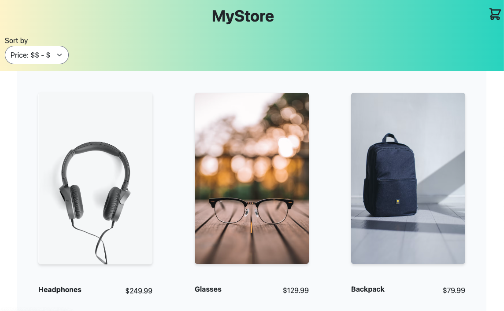

# Mystore
E-commerce front-end application built with the Angular framework complete with cart and checkout functionality.



This application was built as a project for the Udacity Full Stack JavaScript Developer Nanodegree to put into practice Angular components, directives, and services.

## Installation
1. Clone this repository to your local machine.
2. Navigate into the project folder where you cloned this repository.
3. Install the Angular CLI with the following command (skip this step if you already have the Angular CLI installed):
    ```
    npm install -g @angular/cli
    ```
4. Run `npm install` in the CLI to install all project dependencies.
5. Run the following command to launch the project in your browser at `http://localhost:4200/`:
    ```
    ng serve --open
    ```

## Technologies
- Angular
- Tailwind CSS
- Tailwind Elements
- ng bootstrap
- Heroicons
